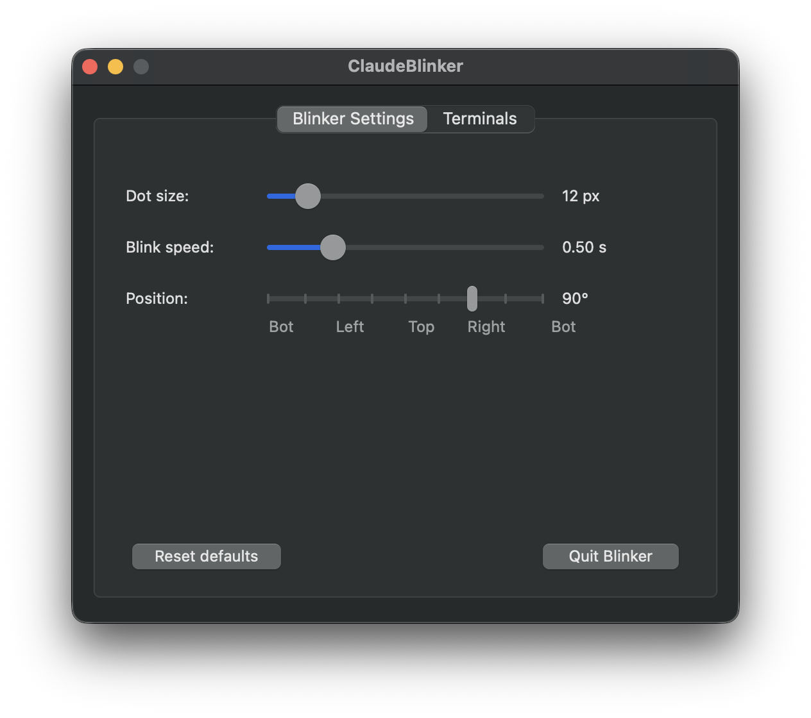
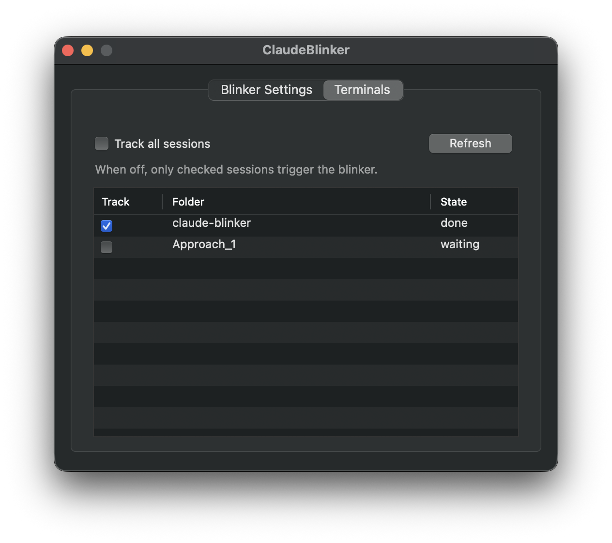

# ClaudeBlinker

A tiny utility that surfaces the live state of every Claude Code session you
have open, across every terminal, as a coloured dot you can park anywhere on
the screen edge.

Supports **macOS**, **Ubuntu**, **WSL** (Windows 11 with WSLg), and
**Windows** (native).

## Screenshots

Blinker settings: dot size, blink speed, and screen-edge position.



Terminals tab: pick which sessions drive the dot.



## Use cases

- **Several Claude terminals at once.** Frontend in one tab, backend in
  another, tests in a third. You can't watch them all. The dot tells you
  which one needs you and the menu-bar icon shows the aggregate state.
- **Long-running turns.** Claude is grinding on a refactor or a test run.
  You jump to email or Slack. The dot turns green when it's done so you
  don't keep tabbing back to check.
- **Permission prompts you'd otherwise miss.** A prompt for Bash or Edit can
  sit for minutes while you assume Claude is still thinking. The dot flips
  to blinking red within four seconds of the stall.
- **Multi-monitor or fullscreen.** The dot floats above fullscreen apps and
  follows you across spaces, so you see state changes even when your
  terminal isn't on the active screen.
- **Click to jump.** Tap the dot to bring the matching Terminal tab to the
  front. No more hunting through windows.

## States

| State    | Colour  | Meaning                                          |
| -------- | ------- | ------------------------------------------------ |
| idle     | hidden  | No active session, or all sessions are quiet     |
| thinking | yellow  | Claude is reasoning between tool calls           |
| coding   | blue    | A tool call is in flight                         |
| waiting  | red     | Permission needed or interactive prompt          |
| done     | green   | Turn finished                                    |

The `waiting` dot blinks so it's hard to miss.

## How it works

Claude Code hooks run `setstate.py` on every prompt, tool, notification and
stop event. The hook writes the current state to
`~/.claude-blinker/sessions/<id>/state` along with `cwd` and `tty` in
`info.json`. The PyObjC app (`app.py`) polls those files every 250 ms and
paints the dot plus the menu-bar icon accordingly.

## Features

- Floating dot overlay visible across spaces and fullscreen apps.
- Menu-bar status icon (`●` coloured, `○` idle).
- Preferences window for dot size, blink speed, and screen-edge position
  (with magnetic snapping at the side midpoints).
- Per-terminal tracking. Track everything, or pick specific sessions.
- Native `NSTableView` session list with alternating row colours.
- Stuck-state promotion: if a tool stays "coding" past 4 seconds (most likely
  blocked on a permission prompt), the dot flips to red automatically.
- Click the dot to jump to the matching Terminal.app tab. Falls back to
  Preferences > Terminals when the target is ambiguous.

## Repo layout

```
.
├── app.py                  macOS overlay (PyObjC/AppKit)
├── app_linux.py            Ubuntu / WSL overlay (GTK3)
├── app_windows.py          Windows native overlay (tkinter + pystray)
├── setstate.py             Hook script — cross-platform, shared by all
├── launcher.sh             macOS bundle entry point
├── Info.plist              macOS bundle metadata
├── ClaudeBlinker.icns      macOS icon
├── hooks-example.json          macOS hooks snippet
├── hooks-example-linux.json    Ubuntu / WSL hooks snippet
├── hooks-example-windows.json  Windows hooks snippet
└── scripts/
    ├── build.sh            Assembles dist/ClaudeBlinker.app (macOS)
    ├── install-linux.sh    Ubuntu / WSL installer
    └── install-windows.ps1 Windows installer
```

`dist/` is gitignored. Build/install locally.

---

## macOS

### Install

```bash
./scripts/build.sh                            # produces dist/ClaudeBlinker.app
cp -R dist/ClaudeBlinker.app /Applications/
open /Applications/ClaudeBlinker.app
```

Merge `hooks-example.json` into `~/.claude/settings.json`. Adjust paths if
the bundle lives somewhere other than `/Applications/`.

The first dot click triggers a macOS Automation permission prompt for
Terminal. Click **OK**.

### Update

```bash
./scripts/build.sh && cp -R dist/ClaudeBlinker.app /Applications/
pkill -f "ClaudeBlinker.app/Contents/Resources/app.py"
open /Applications/ClaudeBlinker.app
```

### Uninstall

```bash
pkill -f "ClaudeBlinker.app/Contents/Resources/app.py"
rm -rf /Applications/ClaudeBlinker.app
rm -rf ~/.claude-blinker
```

Then remove the 6 hook entries from `~/.claude/settings.json`.

### Requirements

- macOS 11 or newer.
- Python 3 with `pyobjc`. Default interpreter: `/opt/anaconda3/bin/python3`.
  Change the path in `launcher.sh` and rebuild if you use a different one.

### Known caveats

- Permission dialogs name the process **python3.13** (the interpreter binary).
  Functionality is unaffected.
- Click-to-focus targets Terminal.app only. iTerm2 not handled yet.
- Dot clicks at exact screen corners can be eaten by macOS gestures.

---

## Ubuntu

### Install

```bash
bash scripts/install-linux.sh
```

This installs system packages (`python3-gi`, GTK3), optionally installs
`pystray` + `pillow` for a system tray icon, copies files to
`~/.local/share/claude-blinker/`, and creates the `claude-blinker` launcher
in `~/.local/bin/`.

```bash
claude-blinker       # start; dot appears on screen edge
```

Merge `hooks-example-linux.json` into `~/.claude/settings.json`.

### Update

```bash
bash scripts/install-linux.sh   # re-run to overwrite installed files
pkill -f "claude-blinker/app.py"
claude-blinker
```

### Uninstall

```bash
pkill -f "claude-blinker/app.py"
rm -rf ~/.local/share/claude-blinker
rm -f ~/.local/bin/claude-blinker
rm -rf ~/.claude-blinker
```

### Requirements

- Python 3 + `python3-gi` + `python3-gi-cairo` + GTK3 (installed by the
  script on apt/dnf/pacman systems).
- `pystray` + `pillow` for the optional system tray icon.

---

## WSL (Windows Subsystem for Linux)

Claude Code runs **inside WSL**. The overlay runs as a Linux GTK app
displayed on the Windows desktop via **WSLg**.

### Requirements

- Windows 11 with WSLg (ships by default).
- The same packages as Ubuntu above.

### Install

Open a WSL terminal and run:

```bash
bash scripts/install-linux.sh
claude-blinker
```

Merge `hooks-example-linux.json` into `~/.claude/settings.json` **inside
WSL** (i.e., `~/.claude/settings.json` in your WSL home directory).

### Troubleshooting

- If the dot does not appear, check that `DISPLAY` is set:
  `echo $DISPLAY` should print something like `:0`.
  WSLg sets this automatically; if it is empty, upgrade to a recent Windows
  11 build or install a manual X server (VcXsrv / X410).
- The system tray icon may not show in all WSLg configurations — the floating
  dot and right-click menu always work regardless.

---

## Windows (native)

For users running Claude Code **natively on Windows** (not inside WSL).

### Install

Open PowerShell and run:

```powershell
powershell -ExecutionPolicy Bypass -File scripts\install-windows.ps1
```

This installs `pystray` + `pillow`, copies files to
`%USERPROFILE%\.local\claude-blinker\`, and creates a launcher batch file at
`%USERPROFILE%\.local\bin\claude-blinker.bat`.

```
claude-blinker.bat   # start the overlay
```

Merge `hooks-example-windows.json` into
`%USERPROFILE%\.claude\settings.json`.

### Update

```powershell
powershell -ExecutionPolicy Bypass -File scripts\install-windows.ps1
taskkill /F /IM pythonw.exe
claude-blinker.bat
```

### Uninstall

```powershell
taskkill /F /IM pythonw.exe
Remove-Item -Recurse "$env:USERPROFILE\.local\claude-blinker"
Remove-Item "$env:USERPROFILE\.local\bin\claude-blinker.bat"
Remove-Item -Recurse "$env:USERPROFILE\.claude-blinker"
```

### Requirements

- Python 3 for Windows (python.org). tkinter ships with it.
- `pystray` + `pillow` (installed by the script).

### Known caveats

- The transparent dot uses tkinter's `-transparentcolor` flag. On some
  multi-monitor HiDPI setups the position may be slightly off due to Windows
  DPI scaling. Adjust via the Position slider in Preferences.
- `pythonw.exe` (not `python.exe`) is used so no console window appears.

---

## Dev workflow (all platforms)

Point hooks at the source `setstate.py` to skip reinstalling on every edit:

```
python3 /path/to/repo/setstate.py <state>
```

Run the overlay directly from the repo:

```bash
# macOS
/opt/anaconda3/bin/python3 app.py

# Linux / WSL
python3 app_linux.py

# Windows
python app_windows.py
```

## License

MIT. See [LICENSE](LICENSE).
